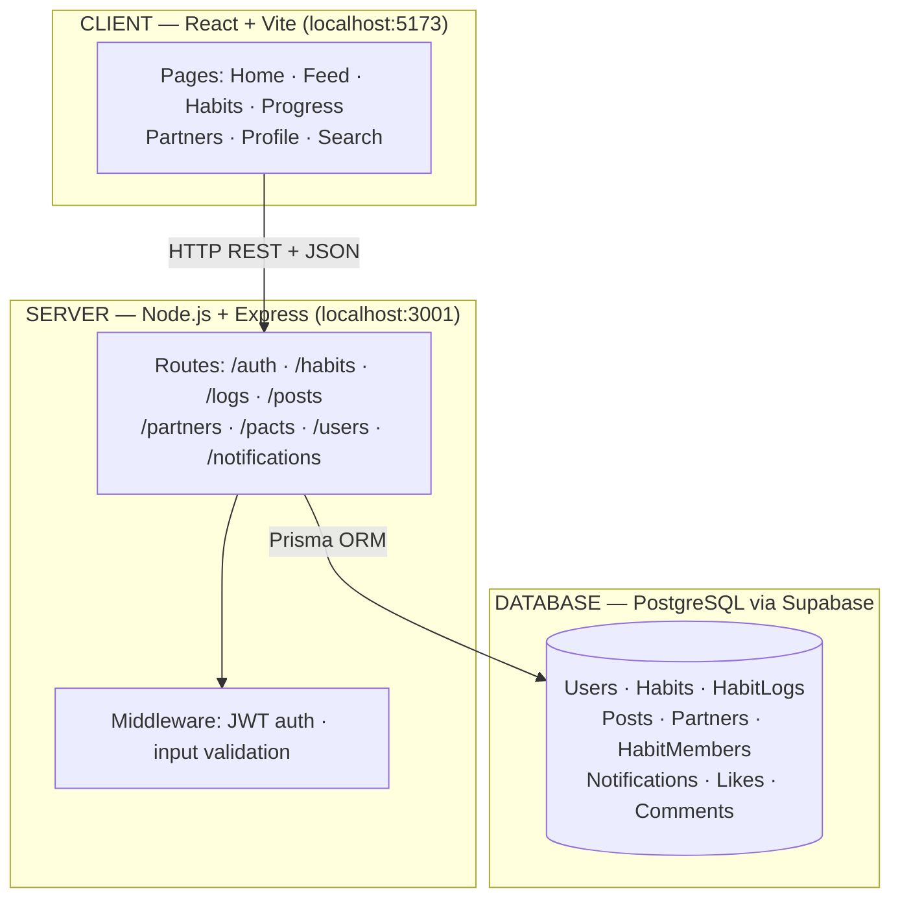
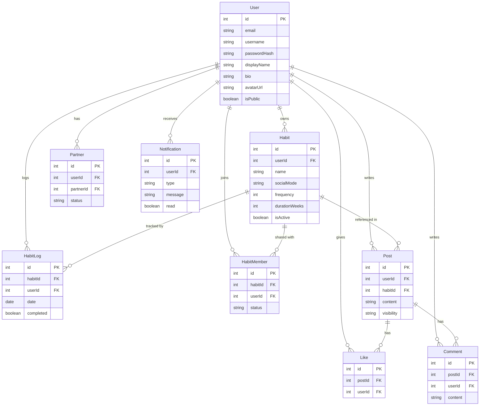

# 🗓️ DayOnes

> **Repo:** https://github.com/kevincoj/DayOnes > **Live App:** https://day-ones-client.vercel.app > **Course:** CS 35L, Spring 2026

DayOnes is a **habit-formation web app** that goes beyond simple streak tracking. It helps users build positive routines and break negative ones by:

- Providing **relapse prevention** through if-then obstacle planning and micro-versions of habits
- Adding a **social layer** — accountability partners, shared habits, pacts, and a live feed of progress posts
- Showing **meaningful progress** through streak tracking and completion stats

The core insight: most habit apps track whether you did the thing. DayOnes helps you figure out _when you won't_ and plans for it in advance.

---

## Table of Contents

1. [Tech Stack](#1-tech-stack)
2. [Architecture Overview](#2-architecture-overview)
3. [How to Run Locally](#3-how-to-run-locally)
4. [How to Run E2E Tests](#4-how-to-run-e2e-tests)
5. [Features](#5-features)
6. [API Routes](#6-api-routes)
7. [Database Schema](#7-database-schema)
8. [Pages & UI Structure](#8-pages--ui-structure)
9. [Rubric Coverage Checklist](#9-rubric-coverage-checklist)

---

## 1. Tech Stack

| Layer           | Technology                           |
| --------------- | ------------------------------------ |
| Frontend        | React (Vite)                         |
| Backend         | Node.js + Express                    |
| Database        | PostgreSQL (hosted on Supabase)      |
| Auth            | JWT (JSON Web Tokens)                |
| ORM             | Prisma                               |
| Styling         | Tailwind CSS                         |
| Charts          | Recharts                             |
| Testing         | Playwright (E2E)                     |
| Hosting         | Vercel (frontend) + Render (backend) |
| Version Control | Git + GitHub                         |

---

## 2. Architecture Overview

### Diagram 1 — System Architecture



### Diagram 2 — Entity Relationship Diagram



---

## 3. How to Run Locally

### Prerequisites

- Node.js v18+
- npm v8+
- No local database needed — the app connects to a hosted Supabase PostgreSQL instance

### Setup

```bash
# 1. Clone the repo
git clone https://github.com/kevincoj/DayOnes.git
cd DayOnes

# 2. Install all dependencies (monorepo — installs client + server together)
npm install

# 3. Set up environment variables
cp apps/server/.env.example apps/server/.env
# Open apps/server/.env and fill in: DATABASE_URL, DIRECT_URL, JWT_SECRET

# 4. Generate the Prisma client
cd apps/server && npx prisma generate && cd ../..

# 5. Run the app (two terminals)

# Terminal 1 — backend (http://localhost:3001)
npm run dev:server

# Terminal 2 — frontend (http://localhost:5173)
npm run dev:client
```

The app will be available at **http://localhost:5173**.

---

## 4. How to Run E2E Tests

Playwright is configured to automatically start both the client and server before running tests. Make sure you have set up your `.env` first (step 3 above), then:

```bash
# First time only — install the Chromium browser
npx playwright install chromium

# Run all E2E tests
npm run test:e2e
```

Tests live in `e2e/` and run in headless Chromium:

- `e2e/auth.spec.ts` — register, logout, and login flow
- `e2e/habit.spec.ts` — habit creation and check-in flow

---

## 5. Features

### Core Features

- **Auth** — register and login with JWT; all data routes are protected
- **Habit tracking** — create habits with a 7-step wizard (name, frequency, trigger cue, micro-version, obstacle plan, social mode, reward); check off daily; log missed days with a reason
- **Progress dashboard** — streak tracking, completion rates, most-missed habit, stats over time powered by Recharts
- **Search** — search habits by name and users by username

### Creative Features

1. **Obstacle / if-then relapse planning** — every habit stores a trigger cue, a micro-version ("if busy, I'll at least…"), and an obstacle plan ("if X, then Y"). On a missed day, the app surfaces the micro-version and obstacle plan to help the user recover rather than quit.
2. **Social feed with likes & comments** — users post habit completions to a feed with private / friends / group visibility; partners can like and comment; the feed is filtered by your partner network.
3. **Pact system** — users can create shared habits (pacts) where multiple members track the same habit side by side, with a shared calendar view of everyone's check-ins.

### Social Features

- Accountability partners — invite by email, accept/revoke
- Partner habit view — see a partner's shared habits and their progress
- Profile pages — avatar, bio, stats bar, post history, privacy toggle
- In-app notifications — bell icon with unread count badge, surfaced on page load

---

## 6. API Routes

### Auth

```
POST   /api/auth/register
POST   /api/auth/login
POST   /api/auth/logout
```

### Habits

```
GET    /api/habits                  Get all habits for current user
POST   /api/habits                  Create new habit
GET    /api/habits/:id              Get single habit
PUT    /api/habits/:id              Update habit
DELETE /api/habits/:id              Soft delete habit
GET    /api/habits/search?q=        Search habits by name
```

### Habit Logs

```
GET    /api/logs?date=              Get logs for a given date
POST   /api/logs                    Mark habit complete or log a miss
PUT    /api/logs/:id                Update a log entry
```

### Posts (Social Feed)

```
GET    /api/posts                   Get feed (filtered by visibility/partner status)
POST   /api/posts                   Create a post
DELETE /api/posts/:id               Delete own post
GET    /api/posts/search?q=         Search posts
```

### Partners

```
POST   /api/partners/invite         Send partner invite by email
PUT    /api/partners/:id/accept     Accept invite
DELETE /api/partners/:id            Revoke partner access
GET    /api/partners                List current partners
GET    /api/partners/:id/habits     View partner's shared habits
```

### Users / Profile

```
GET    /api/users/:username         Get public profile + stats
PUT    /api/users/me                Update own profile
GET    /api/users/:username/posts   Get paginated posts for a user
GET    /api/users/me/friends-feed   Get paginated feed from accepted partners
GET    /api/users/search?q=         Search users by username
```

### Notifications

```
GET    /api/notifications           Get all notifications for user
PUT    /api/notifications/:id       Mark as read
POST   /api/notifications           Create/schedule a reminder
```

---

## 7. Database Schema

```sql
users (
  id            SERIAL PRIMARY KEY,
  email         VARCHAR UNIQUE NOT NULL,
  password_hash VARCHAR NOT NULL,
  username      VARCHAR UNIQUE NOT NULL,
  display_name  VARCHAR,
  bio           TEXT,
  avatar_url    VARCHAR,
  is_public     BOOLEAN DEFAULT TRUE,
  created_at    TIMESTAMP DEFAULT NOW()
)

habits (
  id              SERIAL PRIMARY KEY,
  user_id         INT REFERENCES users(id),
  name            VARCHAR NOT NULL,
  description     TEXT,
  trigger_cue     TEXT,
  micro_version   TEXT,
  obstacle_plan   TEXT,
  social_mode     VARCHAR,        -- 'private' | 'shared' | 'competitive'
  frequency       VARCHAR,        -- 'daily' | 'weekly' | custom
  duration_weeks  INT,
  reward          TEXT,
  is_active       BOOLEAN DEFAULT TRUE,
  created_at      TIMESTAMP DEFAULT NOW()
)

habit_logs (
  id            SERIAL PRIMARY KEY,
  habit_id      INT REFERENCES habits(id),
  user_id       INT REFERENCES users(id),
  date          DATE NOT NULL,
  completed     BOOLEAN NOT NULL,
  missed_reason TEXT,
  created_at    TIMESTAMP DEFAULT NOW()
)

posts (
  id          SERIAL PRIMARY KEY,
  user_id     INT REFERENCES users(id),
  habit_id    INT REFERENCES habits(id),
  content     TEXT,
  visibility  VARCHAR,            -- 'private' | 'friends' | 'group'
  created_at  TIMESTAMP DEFAULT NOW()
)

partners (
  id          SERIAL PRIMARY KEY,
  user_id     INT REFERENCES users(id),
  partner_id  INT REFERENCES users(id),
  status      VARCHAR,            -- 'pending' | 'accepted' | 'revoked'
  created_at  TIMESTAMP DEFAULT NOW()
)

notifications (
  id            SERIAL PRIMARY KEY,
  user_id       INT REFERENCES users(id),
  type          VARCHAR,          -- 'reminder' | 'partner_update' | 'milestone'
  message       TEXT,
  read          BOOLEAN DEFAULT FALSE,
  scheduled_at  TIMESTAMP,
  created_at    TIMESTAMP DEFAULT NOW()
)
```

---

## 8. Pages & UI Structure

```
/login                      Login page
/register                   Sign-up + onboarding

/home                       Dashboard — today's habits, check off, log a miss

/habits                     All habits overview
/habits/new                 7-step habit creation wizard
/habits/:id                 Habit detail, obstacle plan, edit

/feed                       Social feed (posts from partners + self, likes, comments)

/progress                   Streaks, completion rates, most-missed habit (Recharts)

/partners                   Invite / manage accountability partners
/partners/:id               View a partner's shared habits

/profile/:username          Profile — avatar, stats bar, posts, edit modal

/search?q=                  Search habits and users

/settings                   Notification preferences, privacy, account info
```

---

## 9. Rubric Coverage Checklist

| Requirement                           | Points      | How We Meet It                                                                                                                              |
| ------------------------------------- | ----------- | ------------------------------------------------------------------------------------------------------------------------------------------- |
| App displays dynamic data             | 50          | Dashboard, feed, progress stats, partner view, notifications — all fetched from the Express server via REST API                             |
| App uploads data client → backend     | 50          | Habit creation, daily check-ins, missed day logs, posts, likes, comments, partner invites                                                   |
| Security / authentication             | 50          | JWT issued on login, verified by middleware on all protected routes; passwords hashed with bcrypt                                           |
| Meaningful search through server data | 50          | `GET /api/habits/search?q=` (habits by name) and `GET /api/users/search?q=` (users by username)                                             |
| 3 distinct creative features          | 150         | (1) Obstacle/if-then relapse planning, (2) Social feed with likes & comments, (3) Pact system — shared habit tracking with a group calendar |
| Meaningful Git usage                  | 100         | Feature branches, descriptive commit messages, PRs merged to main                                                                           |
| Detailed README — how to run locally  | 50          | Sections 3 and 4 of this document                                                                                                           |
| Visually pleasing & easy to navigate  | 50          | Tailwind CSS, consistent navbar, responsive cards, Recharts progress dashboard                                                              |
| Code readability                      | 100         | Meaningful identifiers, controller/route/middleware separation, shared types across client and server                                       |
| 2+ architecture diagrams in README    | 100         | System architecture diagram + ER diagram (Section 2, rendered by GitHub Mermaid)                                                            |
| 2+ automated E2E tests                | 50          | Playwright: `e2e/auth.spec.ts` (register → logout → login) and `e2e/habit.spec.ts` (create habit → check in)                                |
| Significant code on client AND server | FAIL if not | 10+ Express route controllers + 15+ React pages and components, both non-trivial                                                            |
